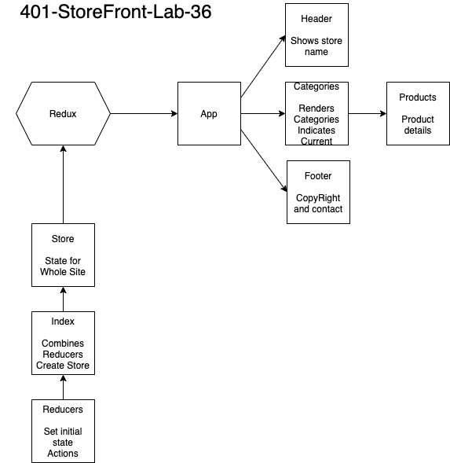
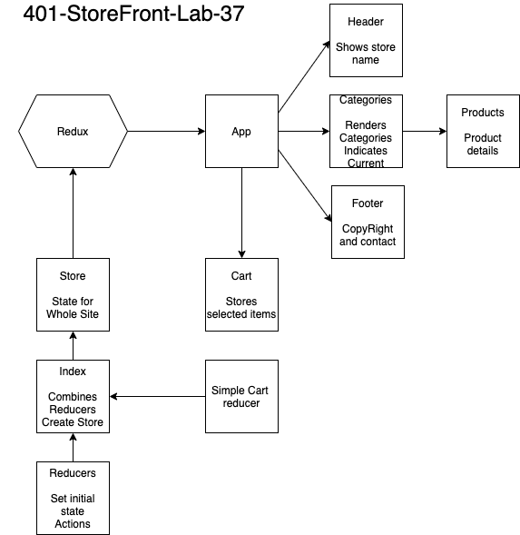
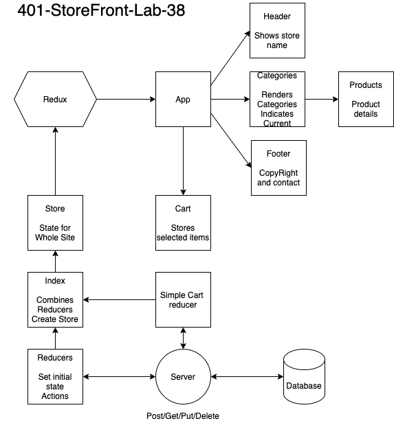

# LAB - Class 36

## Project: Store Front

### Author: Simon Panek

#### Collaborators:  Ricardo, Nathan, Garrett, Dina

#### Image Credits

- Sledge Hammer: `https://images-na.ssl-images-amazon.com/images/I/61iqnRsLgdL._AC_SL1352_.jpg`
- Chop Saw: `https://cdn.makitatools.com/apps/cms/img/ls1/1242566b-9bad-41d4-be5d-45d5dd71e6ae_ls1019l_p_1500px.png`
- Tape Measure: `https://www.zoro.com/static/cms/product/prev/Z-s-rxkcpEx_.JPG`
- Socket Set: `https://images-na.ssl-images-amazon.com/images/I/71mlcw5eqYL._AC_SL1000_.jpg`
- Plywood: `https://images.homedepot-static.com/productImages/6b5c9722-fc3c-4b26-ad5e-dcae58c1ad68/svn/dimensions-project-panels-225487-64_145.jpg`
- Cement: `https://mobileimages.lowes.com/product/converted/039645/039645110263.jpg?size=pdhi`
- Screws: `https://mobileimages.lowes.com/product/converted/764666/764666692169.jpg?size=lg`
- Hared Hat: `https://mobileimages.lowes.com/product/converted/078371/078371912956.jpg?size=pdhi`
- Mask: `https://oshareview.com/wp-content/uploads/2020/05/N95-Mask-1-474x380.jpeg`
- Gloves: `https://encrypted-tbn0.gstatic.com/images?q=tbn:ANd9GcRhGDTf5OOb4Xicqs122O5y5zWDpMcHBftlhtesGIZ6X7I-cZzM5uIZ2LBor0sz-bI1q2_CgEcv&usqp=CAc`
- Harness: `https://encrypted-tbn0.gstatic.com/images?q=tbn:ANd9GcSDZPfXqn6l2NjMApudsTRh4puUgKMcMJDhLQZQ-9nFXzFGqPLbCwi29qK5CaxE-CSjuGdngUVp&usqp=CAc`

### Links and Resources

- [GitHub Pages](https://simon-panek.github.io/store-front/)

### Setup

#### API

- Base Route
  - GET:
  - GET ONE:
  - POST:
  - PUT:
  - DELETE:

#### DataBase Schema

#### `.env` requirements (where applicable)

#### How to initialize/run your application (where applicable)

- `npm start`

#### UML

